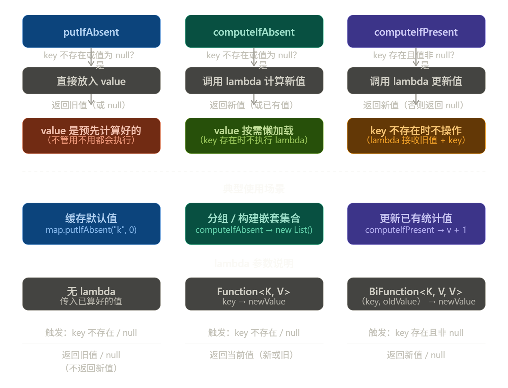

## Map 的三个条件写入方法三个方法的核心区别一句话概括：**触发条件相反，返回值语义不同，lambda 参数也不一样**。下面用代码说明每种用法。

---

### putIfAbsent

```java
Map<String, Integer> map = new HashMap<>();
map.put("a", 1);

// key "a" 已存在 → 不覆盖，返回旧值 1
Integer old = map.putIfAbsent("a", 99);  // old = 1, map["a"] = 1

// key "b" 不存在 → 放入，返回 null
Integer old2 = map.putIfAbsent("b", 10); // old2 = null, map["b"] = 10
```

注意：value `99` 不管用不用都会先**计算好**再传入，如果构造 value 代价大，用 `computeIfAbsent` 更合适。

---

### computeIfAbsent

```java
// 经典用法：构建 Map<String, List<String>> 分组
Map<String, List<String>> groups = new HashMap<>();

groups.computeIfAbsent("fruits", k -> new ArrayList<>()).add("apple");
groups.computeIfAbsent("fruits", k -> new ArrayList<>()).add("banana");
// groups = {"fruits": ["apple", "banana"]}
// 第二次 key 已存在，lambda 不执行，直接返回已有的 List 并 add

// 返回值是"当前 key 对应的值"（新建的或已有的）
List<String> list = groups.computeIfAbsent("vegs", k -> new ArrayList<>());
```

lambda 签名是 `Function<K, V>`，只接收 `key`，返回新 value。**若 lambda 返回 null，则不写入 map。**

---

### computeIfPresent

```java
// 经典用法：对已存在的值做累加统计
Map<String, Integer> counter = new HashMap<>();
counter.put("clicks", 5);

// key 存在 → 执行 lambda，旧值从 5 → 6
counter.computeIfPresent("clicks", (k, v) -> v + 1); // {clicks: 6}

// key 不存在 → 什么都不做，返回 null
counter.computeIfPresent("views", (k, v) -> v + 1);  // null，map 无变化

// lambda 返回 null → 该 key 会被删除
counter.computeIfPresent("clicks", (k, v) -> null);   // "clicks" 被移除
```

lambda 签名是 `BiFunction<K, V, V>`，接收 `(key, oldValue)` 两个参数，返回新 value。

---

### 快速选择口诀

| 场景 | 用哪个 |
|------|--------|
| 写入默认值，value 简单 | `putIfAbsent` |
| 写入默认值，value 构造昂贵（如 new List） | `computeIfAbsent` |
| key 必须已存在才更新（如累加、拼接） | `computeIfPresent` |