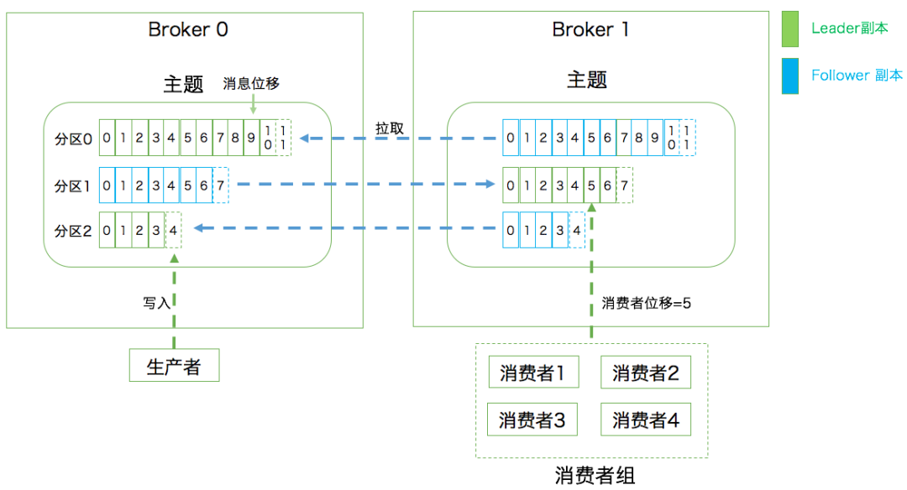

## Kafka

> Kafka 是一种分布式的，基于发布 / 订阅的消息系统



**「主题」**

发布订阅的对象是主题（`Topic`），可以为每 个业务、每个应用甚至是每类数据都创建专属的主题

**「生产者和消费者」**

向主题发布消息的客户端应用程序称为生产者，生产者程序通常持续不断地 向一个或多个主题发送消息

订阅这些主题消息的客户端应用程序就被称为消费者，消费者也能够同时订阅多个主题的消息

**「Broker」**

集群由多个 Broker 组成，`Broker` 负责接收和处理客户端发送过来的请求，以及对消息进行持久化

虽然多个 Broker 进程能够运行在同一台机器上，但更常见的做法是将 不同的 `Broker` 分散运行在不同的机器上，这样如果集群中某一台机器宕机，即使在它上面 运行的所有 Broker 进程都挂掉了，其他机器上的 `Broker` 也依然能够对外提供服务

**「备份机制」**

备份的思想很简单，就是把相同的数据拷贝到多台机器上，而这些相同的数据拷贝被称为副本

定义了两类副本：领导者副本和追随者副本

前者对外提供服务，这里的对外指的是与 客户端程序进行交互；而后者只是被动地追随领导者副本而已，不能与外界进行交互

**「分区」**

分区机制指的是将每个主题划分成多个分区，每个分区是一组有序的消息日志

生产者生产的每条消息只会被发送到一个分区中，也就是说如果向一个双分区的主题发送一条消息，这条消息要么在分区 0 中，要么在分区 1 中

每个分区下可以配置若干个副本，其中只能有 1 个领 导者副本和 N-1 个追随者副本

生产者向分区写入消息，每条消息在分区中的位置信息叫位移

**「消费者组」**

多个消费者实例共同组成一个组来 消费一组主题

这组主题中的每个分区都只会被组内的一个消费者实例消费，其他消费者实例不能消费它

❝

**同时实现了传统消息引擎系统的两大模型：**

❞

如果所有实例都属于同一个 `Group`， 那么它实现的就是消息队列模型；

如果所有实例分别属于不 同的 `Group`，那么它实现的就是发布 / 订阅模型

**「Coordinator：协调者」**

所谓协调者，它专门为 Consumer Group 服务，负责为 Group 执行 Rebalance 以及提供位移管理和组成员管理等。

具体来讲，Consumer 端应用程序在提交位移时，其实是向 Coordinator 所在的 Broker 提交位移，同样地，当 Consumer 应用启动时，也是向 Coordinator 所在的 Broker 发送各种请求，然后由 Coordinator 负责执行消费者组的注册、成员管理记录等元数据管理操作。

所有 Broker 在启动时，都会创建和开启相应的 Coordinator 组件。

也就是说，**「所有 Broker 都有各自的 Coordinator 组件」**。

那么，Consumer Group 如何确定为它服务的 Coordinator 在哪台 Broker 上呢？

通过 Kafka 内部主题`__consumer_offsets`。

目前，Kafka 为某个 Consumer Group 确定 Coordinator 所在的 Broker 的算法有 2 个步骤。

- 第 1 步：确定由`__consumer_offsets`主题的哪个分区来保存该 Group 数据：`partitionId=Math.abs(groupId.hashCode() % offsetsTopicPartitionCount)`。
- 第 2 步：找出该分区 Leader 副本所在的 Broker，该 Broker 即为对应的 Coordinator。

首先，Kafka 会计算该 Group 的`group.id`参数的哈希值。

比如你有个 Group 的`group.id`设置成了`test-group`，那么它的 hashCode 值就应该是 627841412。

其次，Kafka 会计算`__consumer_offsets`的分区数，通常是 50 个分区，之后将刚才那个哈希值对分区数进行取模加求绝对值计算，即`abs(627841412 % 50) = 12`。

此时，我们就知道了`__consumer_offsets`主题的分区 12 负责保存这个 Group 的数据。

有了分区号，我们只需要找出`__consumer_offsets`主题分区 12 的 Leader 副本在哪个 Broker 上就可以了，这个 Broker，就是我们要找的 Coordinator。

**「消费者位移：Consumer Offset」**

消费者消费进度，每个消费者都有自己的消费者位移。

**「重平衡：Rebalance」**

消费者组内某个消费者实例挂掉后，其他消费者实例自动重新分配订阅主题分区的过程。

Rebalance 是 Kafka 消费者端实现高可用的重要手段。

**「AR（Assigned Replicas）」**：分区中的所有副本统称为 AR。

所有消息会先发送到 leader 副本，然后 follower 副本才能从 leader 中拉取消息进行同步。

但是在同步期间，follower 对于 leader 而言会有一定程度的滞后，这个时候 follower 和 leader 并非完全同步状态

**「OSR（Out Sync Replicas）」**：follower 副本与 leader 副本没有完全同步或滞后的副本集合

**「ISR（In Sync Replicas）：\**「AR 中的一个子集，ISR 中的副本都」\**是与 leader 保持完全同步的副本」**，如果某个在 ISR 中的 follower 副本落后于 leader 副本太多，则会被从 ISR 中移除，否则如果完全同步，会从 OSR 中移至 ISR 集合。

在默认情况下，当 leader 副本发生故障时，只有在 ISR 集合中的 follower 副本才有资格被选举为新 leader，而 OSR 中的副本没有机会（可以通过`unclean.leader.election.enable`进行配置）

**「HW（High Watermark）」**：高水位，它标识了一个特定的消息偏移量（offset），消费者只能拉取到这个水位 offset 之前的消息

下图表示一个日志文件，这个日志文件中只有 9 条消息，第一条消息的 offset（LogStartOffset）为 0，最有一条消息的 offset 为 8，offset 为 9 的消息使用虚线表示的，代表下一条待写入的消息。

日志文件的 HW 为 6，表示消费者只能拉取 offset 在 0 到 5 之间的消息，offset 为 6 的消息对消费者而言是不可见的。

**「LEO（Log End Offset)」**：标识当前日志文件中下一条待写入的消息的 offset

上图中 offset 为 9 的位置即为当前日志文件的 LEO，LEO 的大小相当于当前日志分区中最后一条消息的 offset 值加 1

分区 ISR 集合中的每个副本都会维护自身的 LEO ，而 ISR 集合中最小的 LEO 即为分区的 HW，对消费者而言只能消费 HW 之前的消息。

kafka的选举，如果有三个broker，并且分区为3，kafka会把三个分区均匀的分布在三个broker中，partition_topic_0的AR（所有的副本集合[1,2,0]）,根据优先副本原则会选举broker1为分区partition_topic_0的Leader。每一次在新增Consumer消费者或者恢复的时候都会进行Rebanlance，再次进行选举。

#### kafka系统架构

**「kafka设计思想」**

一个最基本的架构是生产者发布 一个消息到Kafka的一个Topic，该Topic的消息存放于Broker中，消费者订阅这个Topic，然后从Broker中消费消息。

**「消息状态：」** 在Kafka中，消息是否被消费的状态保存在Consumer中，Broker不会关心消息是否被消费或被谁消费，Consumer会记录一个offset值（指向partition中下一条将要被消费的消息位置），如果offset被错误设置可能导致同一条消息被多次消费或者消息丢失。

**「批量发送：」** Kafka支持以消息集合为单位进行批量发送，以提高效率。

**「Push-and-Pull：」** Kafka中的Producer和Consumer采用的是Push-and-Pull模式，即Producer向Broker Push消息，Consumer从Broker Pull消息。

**「分区机制（Partition）：」** Kafka的Broker端支持消息分区，Producer可以决定把消息发到哪个Partition，在一个Partition中消息的顺序就是Producer发送消息的顺序，一个Topic中的Partition数是可配置的，Partition是Kafka高吞吐量的重要保证。

通常情况下，一个kafka体系架构包括**「多个Producer」**、**「多个Consumer」**、**「多个broker」**以及**「一个Zookeeper集群」**。

**「Producer」**：生产者，负责将消息发送到kafka中。

**「Consumer」**：消费者，负责从kafka中拉取消息进行消费。

**「Broker」**：Kafka服务节点，一个或多个Broker组成了一个Kafka集群

**「Zookeeper集群」**：负责管理kafka集群元数据以及控制器选举等。

#### 重平衡

**「（重平衡）Rebalance 本质上是一种协议，规定了一个 Consumer Group 下的所有 Consumer 如何达成一致，来分配订阅 Topic 的每个分区」**。

比如某个 Group 下有 20 个 Consumer 实例，它订阅了一个具有 100 个分区的 Topic。

正常情况下，Kafka 平均会为每个 Consumer 分配 5 个分区。这个分配的过程就叫 Rebalance。

**「Rebalance 的触发条件有 3 个。」**

1. 组成员数发生变更。比如有新的 Consumer 实例加入组或者离开组，或是有 Consumer 实例崩溃被踢出组。
2. 订阅主题数发生变更。Consumer Group 可以使用正则表达式的方式订阅主题，比如`consumer.subscribe(Pattern.compile(“t.*c”))`就表明该 Group 订阅所有以字母 t 开头、字母 c 结尾的主题，在 Consumer Group 的运行过程中，你新创建了一个满足这样条件的主题，那么该 Group 就会发生 Rebalance。
3. 订阅主题的分区数发生变更。Kafka 当前只能允许增加一个主题的分区数，当分区数增加时，就会触发订阅该主题的所有 Group 开启 Rebalance。

**「Coordinator 会在什么情况下认为某个 Consumer 实例已挂从而要退组呢？」**

当 Consumer Group 完成 Rebalance 之后，每个 Consumer 实例都会定期地向 Coordinator 发送心跳请求，表明它还存活着。

如果某个 Consumer 实例不能及时地发送这些心跳请求，Coordinator 就会认为该 Consumer 已经死了，从而将其从 Group 中移除，然后开启新一轮 Rebalance。

Consumer 端有个参数，叫`session.timeout.ms`。

该参数的默认值是 10 秒，即如果 Coordinator 在 10 秒之内没有收到 Group 下某 Consumer 实例的心跳，它就会认为这个 Consumer 实例已经挂了。

除了这个参数，Consumer 还提供了一个允许你控制发送心跳请求频率的参数，就是`heartbeat.interval.ms`。

这个值设置得越小，Consumer 实例发送心跳请求的频率就越高。

频繁地发送心跳请求会额外消耗带宽资源，但好处是能够更加快速地知晓当前是否开启 Rebalance，因为，目前 Coordinator 通知各个 Consumer 实例开启 Rebalance 的方法，就是将`REBALANCE_NEEDED`标志封装进心跳请求的响应体中。

除了以上两个参数，Consumer 端还有一个参数，用于控制 Consumer 实际消费能力对 Rebalance 的影响，即`max.poll.interval.ms`参数。

它限定了 Consumer 端应用程序两次调用 poll 方法的最大时间间隔。

它的默认值是 5 分钟，表示你的 Consumer 程序如果在 5 分钟之内无法消费完 poll 方法返回的消息，那么 Consumer 会主动发起离开组的请求，Coordinator 也会开启新一轮 Rebalance。

**「可避免 Rebalance 的配置」**

第一类 Rebalance 是因为未能及时发送心跳，导致 Consumer 被踢出 Group 而引发的

因此可以设置**「session.timeout.ms 和 heartbeat.interval.ms」**的值。

- 设置`session.timeout.ms` = 6s。
- 设置`heartbeat.interval.ms` = 2s。
- 要保证 Consumer 实例在被判定为 dead 之前，能够发送至少 3 轮的心跳请求，即`session.timeout.ms >= 3 * heartbeat.interval.ms`。

将`session.timeout.ms`设置成 6s 主要是为了让 Coordinator 能够更快地定位已经挂掉的 Consumer。

**「第二类 Rebalance 是 Consumer 消费时间过长导致的」**。

你要为你的业务处理逻辑留下充足的时间，这样 Consumer 就不会因为处理这些消息的时间太长而引发 Rebalance 了。

#### 事务

# 事务

Kafka 自 0.11 版本开始也提供了对事务的支持，目前主要是在 read committed 隔离级别上做事情。

它能保证多条消息原子性地写入到目标分区，同时也能保证 Consumer 只能看到事务成功提交的消息。

**「事务型 Producer」**

事务型 Producer 能够保证将消息原子性地写入到多个分区中。

这批消息要么全部写入成功，要么全部失败，另外，事务型 Producer 也不惧进程的重启。

Producer 重启回来后，Kafka 依然保证它们发送消息的精确一次处理。

设置事务型 Producer 的方法也很简单，满足两个要求即可：

- 和幂等性 Producer 一样，开启`enable.idempotence = true`。
- 设置 Producer 端参数`transactional. id`，最好为其设置一个有意义的名字。

此外，你还需要在 Producer 代码中做一些调整，如这段代码所示：

```java
producer.initTransactions();
try {
            producer.beginTransaction();
            producer.send(record1);
            producer.send(record2);
            producer.commitTransaction();
} catch (KafkaException e) {
            producer.abortTransaction();
}
```

和普通 Producer 代码相比，事务型 Producer 的显著特点是调用了一些事务 API，如 initTransaction、beginTransaction、commitTransaction 和 abortTransaction，它们分别对应事务的初始化、事务开始、事务提交以及事务终止。

这段代码能够保证 Record1 和 Record2 被当作一个事务统一提交到 Kafka，要么它们全部提交成功，要么全部写入失败。

实际上即使写入失败，Kafka 也会把它们写入到底层的日志中，也就是说 Consumer 还是会看到这些消息。

有一个`isolation.level`参数，这个参数有两个取值：

1. `read_uncommitted`：这是默认值，表明 Consumer 能够读取到 Kafka 写入的任何消息，不论事务型 Producer 提交事务还是终止事务，其写入的消息都可以读取，如果你用了事务型 Producer，那么对应的 Consumer 就不要使用这个值。
2. `read_committed`：表明 Consumer 只会读取事务型 Producer 成功提交事务写入的消息，它也能看到非事务型 Producer 写入的所有消息。
