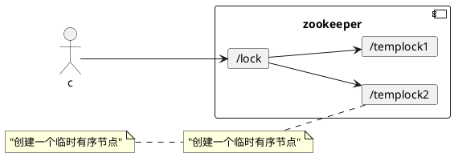
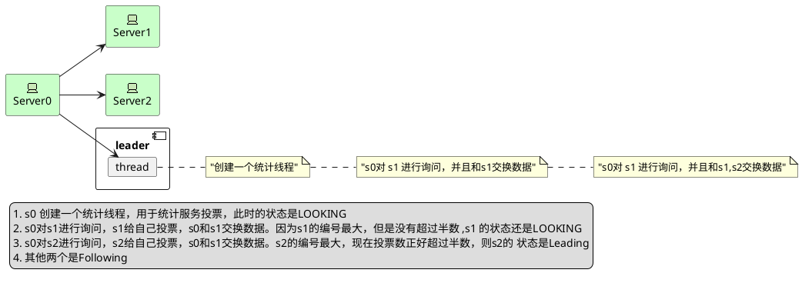

# zookeeper
> ZooKeeper 是一个开源的分布式协调服务。它是一个为分布式应用提供一致性 服务的软件，分布式应用程序可以基于 Zookeeper 实现诸如数据发布/订阅、 负载均衡、命名服
> 务、分布式协调/通知、集群管理、Master 选举、分布式锁和 分布式队列等功能。  

## 分布式锁

1. 先创建一个临时有序节点znode
2. 客户端扫描 捕获所有的节点，如果发现自己创建的节点顺序最小，则相当于获取了锁，当锁使用结束后，会将节点进行删除
3. 如果发现创建的节点不是最小，则表示没有获取到锁，客户端会找到比自己小的节点并且加入到watcher中进行监听，如果监听到比自己小的被删除则会收到通知，
此时再次判断自己创建的是否是最小的，如果不是则继续监听

### 四种类型znode

1. PERSISTENT 持久化节点

   除非手动删除，否则节点一直存在于 Zookeeper 上  

2. EPHEMRAL 临时节点

   临时节点的生命周期与客户端会话绑定，一旦客户端会话失效（客户端与 zookeeper 连接断开不一定会话失效），那么这个客户端创建的所有临时节点 都会被移除。  

3. PERSISTENT_SEQUENTIAL 持久化顺序节点

   基本特性同持久节点，只是增加了顺序属性，节点名后边会追加一个由父节点维 护的自增整型数字  

4. EPHEMRAL_SEQUENTIAL  临时顺序节点

   基本特性同临时节点，增加了顺序属性，节点名后边会追加一个由父节点维护的 自增整型数字  
   
#### zookeeper原理

zookeeper的核心是/color:Red`原子广播`形式，这个机制保证了各个Server之间的同步，实现这个机制的协议是zab协议，他么你分别是`恢复模式`和`广播模式`，当服务刚启动或者leader宕机的时候，zab就进入了恢复模式，当领导者被选举出来，
并且大多数Server完成了和leader的状态同步之后，恢复模式就结束了，状态同步 保证leader和Server具有相同的系统状态。

#### zookeeper是如何保持事务顺序一致性

zookeeper采用全局递增的事务id来标志，所有的proposal（提议）都在被提出的时候加上zxid，zxid 实际上是一个 64 位的数字，高 32 位是
epoch（ 时期; 纪元; 世; 新时代）用来标识 leader 周期，如果有新的 leader 产生出来，epoch会自增，低 32 位用来递增计数。当新产生 proposal 的时候，会依据数据库的两
阶段过程，首先会向其他的 server 发出事务执行请求，如果超过半数的机器都能执行并且能够成功，那么就会开始执行。  

#### zookeeper应用场景

1. 数据发布/订阅
2. 负载均衡
3. 命名服务
4. 分布式协调/通知
5. 集群管理
6. Master选举
7. 分布式锁
8. 分布式队列数据发布/订阅

#### Zookeeper 下Server工作状态
* LOOKING 当前Server不知道leader是谁，正在搜寻
* LEADING 当前Server即为选举出来的leader
* FOLLOWING leader已经选举出来，当前Server与之同步。

#### zookeeper 是如何选举出来leader的
（1） 选举线程由当前 Server 发起选举的线程担任，其主要功能是对投票结果进行统计，并选出推荐的Server；
（2） 选举线程首先向所有 Server 发起一次询问(包括自己)；
（3） 选举线程收到回复后，验证是否是自己发起的询问(验证 zxid 是否一致)，然后获取对方的 id(myid)，并存储到当前询问对象列表中，最后获取对方提议的 leader 相关信
息(id,zxid)，并将这些信息存储到当次选举的投票记录表中；
（4） 收到所有 Server 回复以后，就计算出 zxid 最大的那个 Server，并将这个 Server 相关信息设置成下一次要投票的 Server；
（5） 线程将当前 zxid 最大的 Server 设置为当前 Server 要推荐的 Leader，如果此时获胜的 Server 获得 n/2 + 1 的 Server 票数，设置当前推荐的 leader 为获胜的 Server，
将根据获胜的 Server 相关信息设置自己的状态，否则，继续这个过程，直到 leader 被选举出来。 通过流程分析我们可以得出：要使 Leader 获得多数Server 的支持，则 Server
总数必须是奇数 2n+1，且存活的 Server 的数目不得少于 n+1. 每个 Server 启动后都会重复以上流程。在恢复模式下，如果是刚从崩溃状态恢复的或者刚启动的 server 还会从磁
盘快照中恢复数据和会话信息，zk 会记录事务日志并定期进行快照，方便在恢复时进行状态恢复

#### Zookeeper 如何保证主从同步

Zookeeper 的核心是原子广播机制，这个机制保证了各个 server 之间的同步。 实现这个机制的协议叫做 Zab 协议。Zab 协议有两种模式，它们分别是恢复模 式和广播模式。
恢复模式
当服务启动或者在领导者崩溃后，Zab就进入了恢复模式，当领导者被选举出 来，且大多数 server 完成了和 leader 的状态同步以后，恢复模式就结束了。状 态同步保证了
leader 和 server 具有相同的系统状态。
广播模式
一旦 leader 已经和多数的 follower 进行了状态同步后，它就可以开始广播消息 了，即进入广播状态。这时候当一个 server 加入 ZooKeeper 服务中，它会在 恢复模式下启动，
发现 leader，并和 leader 进行状态同步。待到同步结束，它也参与消息广播。ZooKeeper 服务一直维持在 Broadcast 状态，直到 leader 崩溃了或者 leader 失去了大部分的
followers 支持。