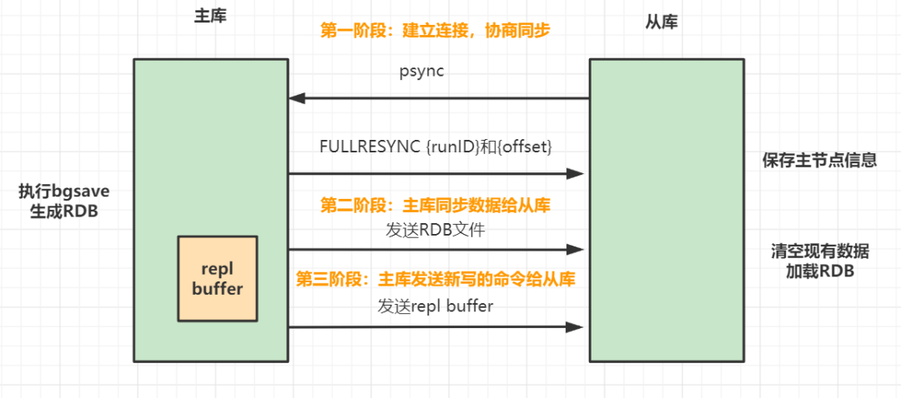

## Redis 主从同步

Redis主从同步包括三个阶段。

第一阶段：主从库间建立连接、协商同步。

> - 从库向主库发送`psync` 命令，告诉它要进行数据同步。
> - 主库收到 `psync` 命令后,响应`FULLRESYNC`命令（它表示第一次复制采用的是全量复制），并带上主库`runID`和主库目前的复制进度`offset`。

第二阶段：主库把数据同步到从库，从库收到数据后，完成本地加载。

> - 主库执行`bgsave`命令，生成`RDB`文件，接着将文件发给从库。从库接收到`RDB `文件后，会先清空当前数据库，然后加载 RDB 文件。
> - 主库把数据同步到从库的过程中，新来的写操作，会记录到`replication buffer`。

第三阶段，主库把新写的命令，发送到从库。

> - 主库完成RDB发送后，会把`replication buffer`中的修改操作发给从库，从库再重新执行这些操作。这样主从库就实现同步啦。