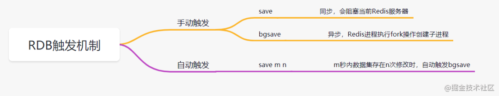

## Redis 持久化有哪几种方式

> 既然它是基于内存的，如果Redis服务器挂了，数据就会丢失。为了避免数据丢失了，Redis提供了两种持久化方式，**RDB和AOF**。

### AOF 持久化

AOF（append only file） 持久化，采用日志的形式来记录每个写操作，追加到AOF文件的末尾。**Redis默认情况是不开启AOF的**。重启时再重新执行AOF文件中的命令来恢复数据。它主要解决数据持久化的实时性问题。

AOF是**执行完命令后才记录日志的**。为什么不先记录日志再执行命令呢？这是因为Redis在向AOF记录日志时，不会先对这些命令进行语法检查，如果先记录日志再执行命令，日志中可能记录了错误的命令，Redis使用日志回复数据时，可能会出错。

正是因为执行完命令后才记录日志，所以不会阻塞当前的写操作。但是会存在**两个风险**：

1. 更执行完命令还没记录日志时，宕机了会导致数据丢失
2. AOF不会阻塞当前命令，但是可能会阻塞下一个操作。

这两个风险最好的解决方案是折中妙用**AOF机制的三种写回策略** `appendfsync`：

1. always，**同步写回**，每个子命令执行完，都立即将日志写回磁盘。
2. everysec，每个命令执行完，只是先把日志写到AOF内存缓冲区，每隔一秒同步到磁盘。
3. no：只是先把日志写到AOF内存缓冲区，有操作系统去决定何时写入磁盘。

`always`同步写回，可以基本保证数据不丢失，`no`策略则性能高但是数据可能会丢失，一般可以考虑折中选择`everysec`。

如果接受的命令越来越多，AOF文件也会越来越大，文件过大还是会带来性能问题。日志文件过大怎么办呢？**AOF重写机制**！就是随着时间推移，AOF文件会有一些冗余的命令如：无效命令、过期数据的命令等等，AOF重写机制就是把它们合并为一个命令（类似批处理命令），从而达到**精简压缩空间**的目的。

**AOF重写**会阻塞嘛？AOF日志是由主线程会写的，而重写则不一样，重写过程是由后台子进程**bgrewriteaof**完成。

- **AOF的优点**：数据的一致性和完整性更高，秒级数据丢失。
- **缺点**：相同的数据集，AOF文件体积大于RDB文件。数据恢复也比较慢。

### RDB

因为AOF持久化方式，如果操作日志非常多的话，**Redis恢复就很慢**。有没有在宕机快速恢复的方法呢，有的，RDB！

**RDB**，就是把内存数据以**快照**的形式保存到磁盘上。和AOF相比，它记录的是某一时刻的数据，，并不是操作。

> 什么是快照?可以这样理解，给当前时刻的数据，拍一张照片，然后保存下来。

RDB持久化，是指在指定的时间间隔内，执行指定次数的写操作，将内存中的数据集快照写入磁盘中，它是Redis默认的持久化方式。执行完操作后，在指定目录下会生成一个dump.rdb文件，Redis 重启的时候，通过加载dump.rdb文件来恢复数据。RDB触发机制主要有以下几种：

RDB通过`bgsave`命令的执行全量快照，可以**避免阻塞主线程**。basave命令会fork一个子进程，然后该子进程会负责创建RDB文件，而服务器进程会继续处理命令请求

**快照时，数据能修改嘛？** Redis接住操作系统的写时复制技术（**copy-on-write，COW**）,在执行快照的同时，正常处理写操作。

虽然`bgsave`执行不会阻塞主线程，但是频繁执行全量快照也会带来性能开销。比如bgsave子进程需要通过fork操作从主线程创建出来，创建后不会阻塞主线程，但是创建过程是会阻塞主线程的。可以做**增量快照**。

- **RDB的优点**：与AOF相比，恢复大数据集的时候会更快，它适合大规模的数据恢复场景，如备份，全量复制等
- **缺点**：没办法做到实时持久化/秒级持久化。

Redis4.0开始支持**RDB和AOF的混合持久化**，就是内存快照以一定频率执行，两次快照之间，再使用AOF记录这期间的所有命令操作。

###如何选择RDB和AOF

- 如果数据不能丢失，RDB和AOF混用
- 如果只作为缓存使用，可以承受几分钟的数据丢失的话，可以只使用RDB。
- 如果只使用AOF，优先使用everysec的写回策略。