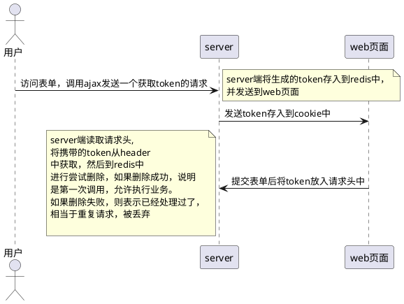

# 幂等性

> Q：接口幂等性最佳实践：

[面试](https://mp.weixin.qq.com/s/n526mipXeKFKtmYA26sh3Q)

## 产生幂等性问题的根本原因：

1. 用户重复提交：一般是指用户填好表单信息后，由于响应较慢，从而多次点击提交按钮。
2. 非法调用：第三方通过逆向手段调试到了接口地址，然后通过爬虫或接口工具多次调用
3. 失败重试：指分布式项目中，被调用方出现超时或异常时，出发了调用方的重试补偿机制。
4. 重复消息：通常指引入MQ项目，对于同一个消息，生产者多次发送，或者消费者重复消费。

## 多个层面解决幂等性问题的方案

### 前端

1. 按钮变灰/或变为Loading状态：防止用户点击多次按钮，造成多个重复请求出现。
2. 重定向页面：防止用户通过刷新/回退的方式，造成多个重复请求出现。

### 后端：

1. 唯一Key方案：现根据业务参数，从中选出或计算出一个全局唯一key
   
   - 唯一key计算方案：
     - 选用请求参数的某个特殊值，如手机号、订单号...作为key
     - 通过Hash函数来对所有参数进行哈希计算，得到一个Key。
     - 非注册的场景，可以使用但钱用户ID + 目标方法名作为Key。
   - 得到唯一Key之后，通过set nx px命令向Redis插入数据
     - 成功：代表前面没有重复的请求，当前请求可以执行
     - 失败：代表前面有相同的请求已经插入过了，当前请求需要被丢弃。

2. 防重表方案：使用业务的唯一ID，如订单号作为唯一索引，操作之前先插入防重表。

3. 状态机方案：在表上多加一个状态字段，对于update操作加上状态判断，如订单表：
   
   - 将【待付款】改为【待发货】：update ... status =2 where status =1
   - 这样就算出多个修改亲求，因为第一个请求改成功后，状态为2，其他请求都会失败。

4. Token方案：

